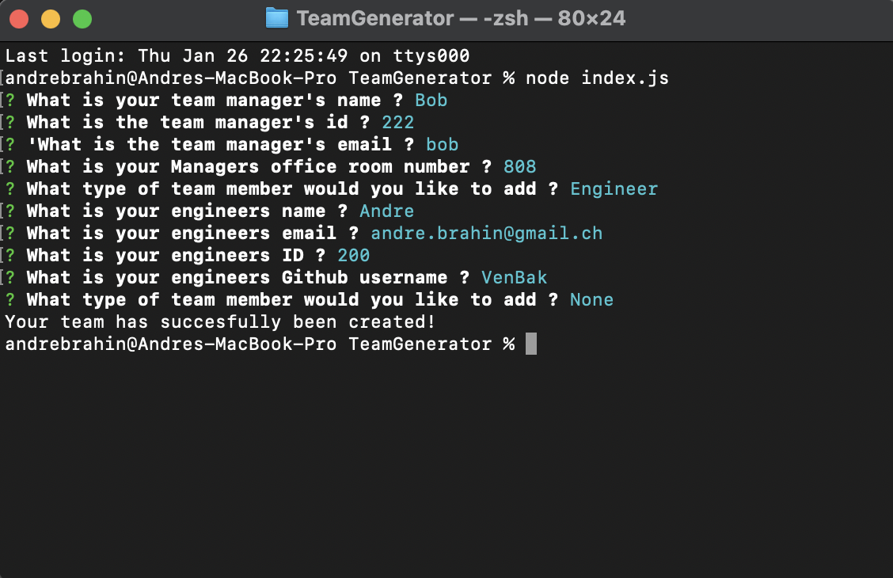
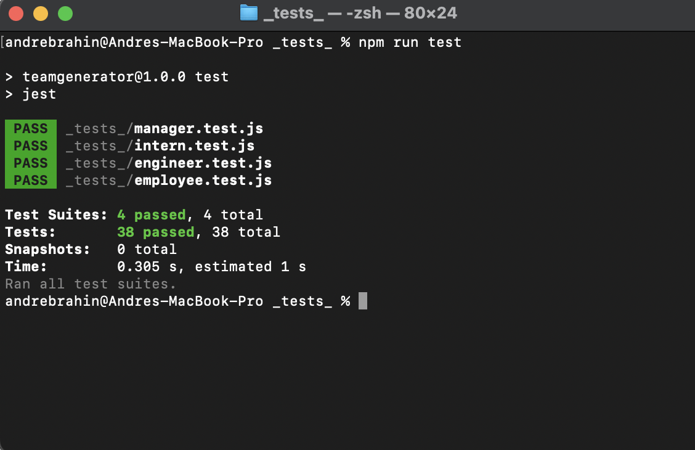

# TeamGenerator

## Description

Provide a short description explaining the what, why, and how of your project. Use the following questions as a guide:

- What was your motivation?
- Why did you build this project? (Note: the answer is not "Because it was a homework assignment.")
- What problem does it solve?
- What did you learn?

The purpose of this project was to create a tool used to develop teams within the command line interface using Node.js and the node package manager (npm) in order to achieve that. The motivation behind this project was to further understand the intricacies of using node.js but also understanding how the back-end can be used to create and store objects. During the development of this project I learnt how to use classes and constructors in order to create objects. The problems that this project solves is having to manually create an html file for data which you already know how will be structured. Thus using this project makes this task much more efficient and taught me many fundamentals

## Table of Contents (Optional)

If your README is long, add a table of contents to make it easy for users to find what they need.

- [Installation](#installation)
- [Usage](#usage)
- [Credits](#credits)
- [License](#license)

## Installation

If you wish to install this project make sure to have all of the appropriate dependencies installed which are part of the node package manager library:
- Inquirer
- Path
- Jest (if you wish to conduct any tests)

Here are the command lines which you might have to run in order to make sure the dependencies are installed on your local machine 

npm install --save inquirer@^8.0.0
npm install --save-dev jest
npm install --save path

## Usage

If you want to use this application follow the steps accordingly:
- Install node.js to your machine
- Make sure you install all of the dependencies or else it won't work
(npm install --save inquirer@^8.0.0
npm install --save-dev jest
npm install --save path
)
- After which make sure that 'npm i' works in the terminal
- After that you should be all set to type in 'node index.js' to launch the node file 

Here's a screenshot of what your terminal should look like if you run this application

## Credits

List your collaborators, if any, with links to their GitHub profiles.

If you used any third-party assets that require attribution, list the creators with links to their primary web presence in this section.

If you followed tutorials, include links to those here as well.

## License

This project is covered under the MIT license

## How to Contribute

If you wish to contribute simply send me an email to andre.brahin@gmail.com

## Tests

I tested my application through the jest package from npm. Here's how to run a test if you wish to:
- Install Jest:
npm install --save-dev jest
- use 'npm run test' to run a general test
- use 'npm run test employee' for a specific file

Here's what a successful run of the tests should look like:

Credits:
https://github.com/with-heart/jest-matcher-structure 